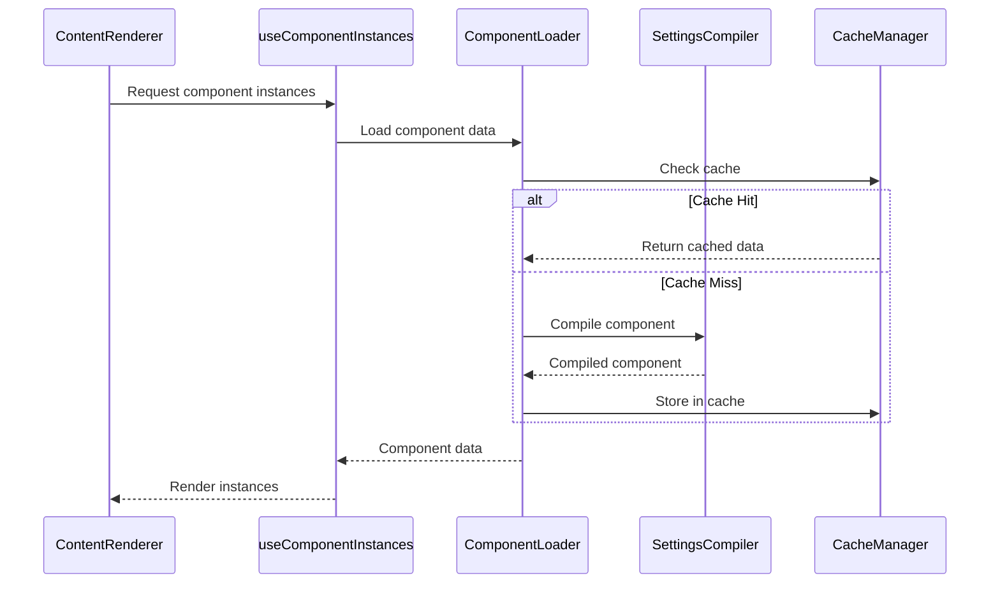
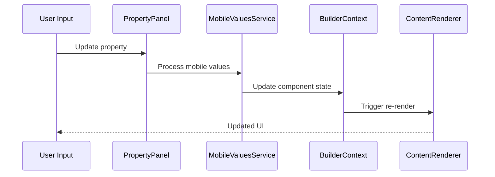

# System Architecture Guide

This document provides a comprehensive overview of the Component Rendering System architecture, including data flow, component relationships, and design patterns.

## 🏗️ Overview

The Component Rendering System follows a layered architecture with clear separation of concerns:

- **Presentation Layer**: React components and UI logic
- **Service Layer**: Business logic and data processing
- **Data Layer**: State management and caching

## 📊 Architecture Diagram

The system is built using a modular architecture where each layer has specific responsibilities:

```
┌─────────────────────────────────────────────────────────────┐
│                  Presentation Layer                         │
├─────────────────────────────────────────────────────────────┤
│  ┌─────────────────┐  ┌─────────────────┐  ┌─────────────────┐ │
│  │  ContentRenderer│  │ ComponentInstance│  │ PropertyPanel  │ │
│  └─────────────────┘  └─────────────────┘  └─────────────────┘ │
└─────────────────────────────────────────────────────────────┘
                              │
┌─────────────────────────────────────────────────────────────┐
│                   Service Layer                             │
├─────────────────────────────────────────────────────────────┤
│  ┌─────────────────┐  ┌─────────────────┐  ┌─────────────────┐ │
│  │ ComponentLoader │  │ SettingsCompiler│  │ MobileValues    │ │
│  │ Service         │  │ Service         │  │ Service         │ │
│  └─────────────────┘  └─────────────────┘  └─────────────────┘ │
└─────────────────────────────────────────────────────────────┘
                              │
┌─────────────────────────────────────────────────────────────┐
│                    Data Layer                               │
├─────────────────────────────────────────────────────────────┤
│  ┌─────────────────┐  ┌─────────────────┐  ┌─────────────────┐ │
│  │ Component State │  │ Builder Context │  │ Cache Manager   │ │
│  └─────────────────┘  └─────────────────┘  └─────────────────┘ │
└─────────────────────────────────────────────────────────────┘
```

## 🔄 Data Flow

### Component Rendering Flow



### Property Update Flow



## 🏢 Core Components

### 1. ContentRenderer

**Purpose**: Main rendering component that orchestrates the display of dynamic components.

**Responsibilities**:
- Manages component lifecycle
- Handles view mode switching (mobile/desktop)
- Aggregates component styles
- Provides error boundaries

**Key Features**:
- Memoized rendering for performance
- Stable reference management
- Conditional rendering based on view mode

```tsx
interface ContentRendererProps {
  components: ComponentState[];
  viewMode: "desktop" | "mobile";
}

export function ContentRenderer({ components, viewMode }: ContentRendererProps) {
  const { instances, aggregatedStyles, retryComponent, isPending } = 
    useComponentInstances(components);
  
  // Implementation details...
}
```

### 2. ComponentInstance

**Purpose**: Individual component wrapper that handles rendering, error states, and user interactions.

**Responsibilities**:
- Component prop computation
- Language and settings compilation
- Mobile/desktop value resolution
- Error state management

**State Machine**:
```
idle → loading → loaded ↔ error
  ↑                ↓
  └── retry ←------┘
```

### 3. useComponentInstances Hook

**Purpose**: Custom hook that manages component instances state and lifecycle.

**Responsibilities**:
- Component loading and compilation
- State synchronization
- Performance optimization
- Error handling and retry logic

**Performance Features**:
- Batch state updates
- Memoized computations
- Change detection optimization
- Memory leak prevention

## 🚀 Performance Architecture

### Caching Strategy

The system implements a multi-layer caching strategy:

```
┌─────────────────┐
│   Component     │ ←─── TTL: 10 minutes
│     Cache       │      Size: 200 entries
└─────────────────┘
         │
┌─────────────────┐
│   Settings      │ ←─── TTL: 5 minutes  
│     Cache       │      Size: 100 entries
└─────────────────┘
         │
┌─────────────────┐
│ Mobile Values   │ ←─── TTL: 5 minutes
│     Cache       │      Size: 50 entries
└─────────────────┘
```

### Memory Management

- **Automatic Cleanup**: Caches automatically remove stale entries
- **Size Limits**: Prevents unlimited memory growth
- **Weak References**: Used where appropriate to prevent memory leaks
- **Garbage Collection**: Efficient cleanup of unused components

### Render Optimization

```tsx
// Before Optimization
function ComponentInstance({ instance, onRetry }) {
  // Expensive computation on every render
  const props = computeExpensiveProps(instance);
  
  return <div onClick={() => onRetry(instance.id)}>{/* content */}</div>;
}

// After Optimization
const ComponentInstance = memo(({ instance, onRetry }) => {
  // Memoized computation
  const props = useMemo(() => computeExpensiveProps(instance), [
    instance.id,
    instance.timestamp,
    instance.props
  ]);
  
  // Stable callback reference
  const handleRetry = useCallback(() => onRetry(instance.id), [
    onRetry,
    instance.id
  ]);
  
  return <div onClick={handleRetry}>{/* content */}</div>;
});
```

## 🔧 Service Layer

### ComponentLoader Service

**Purpose**: Handles dynamic loading and compilation of components.

**Features**:
- Asynchronous component loading
- Error handling with retry logic
- Timeout management
- Cache integration

```tsx
interface ComponentFetchResult {
  component: React.ComponentType<unknown>;
  styles: string;
  prefix: string;
}

export async function loadComponent(
  name: string, 
  id: string
): Promise<ComponentFetchResult> {
  // Implementation with caching and error handling
}
```

### SettingsCompiler Service

**Purpose**: Compiles TypeScript settings files into executable objects.

**Features**:
- Runtime TypeScript compilation
- Module context creation
- Error handling and validation
- Performance caching

### MobileValuesService

**Purpose**: Manages mobile-specific property values and transformations.

**Features**:
- Value filtering and merging
- Desktop/mobile value comparison
- Cached computation results
- Deep object manipulation

## 🎯 Design Patterns

### 1. Observer Pattern
- Builder context notifies components of state changes
- Components subscribe to relevant state updates
- Unsubscription on component unmount

### 2. Factory Pattern
- Component state creation factory
- Consistent state object structure
- Type safety and validation

### 3. Strategy Pattern
- Different compilation strategies for different file types
- Mobile vs desktop value resolution strategies
- Error handling strategies

### 4. Facade Pattern
- Simple API surface for complex underlying operations
- Unified interface for different services
- Abstraction of implementation details

## 🔐 Error Handling

### Error Boundaries

```tsx
<ErrorBoundary
  componentName={instance.name}
  fallback={(error) => (
    <ErrorDisplay error={error} onRetry={handleRetry} />
  )}
>
  <ComponentInstance instance={instance} />
</ErrorBoundary>
```

### Error Recovery

- **Automatic Retry**: Failed components are retried with exponential backoff
- **Fallback Rendering**: Previous working versions are displayed during errors
- **User Feedback**: Clear error messages and recovery options
- **Logging**: Comprehensive error logging for debugging

## 📈 Scalability Considerations

### Horizontal Scaling
- Component instances can be loaded independently
- Parallel compilation of multiple components
- Distributed caching strategies

### Vertical Scaling
- Memory usage optimization
- CPU-intensive operations moved to background
- Lazy loading of non-critical components

### Performance Monitoring
- Render time tracking
- Memory usage monitoring
- Cache hit/miss ratios
- Error rate tracking

## 🔮 Future Enhancements

### Planned Features
1. **Web Workers**: Move compilation to background threads
2. **Service Workers**: Persistent component caching
3. **Virtual Scrolling**: Handle large component lists
4. **Code Splitting**: Dynamic import of compilation logic

### Performance Improvements
1. **Precompilation**: Build-time component compilation
2. **Bundle Optimization**: Tree-shaking unused features
3. **CDN Integration**: Component delivery via CDN
4. **Progressive Loading**: Incremental component loading

---

This architecture provides a solid foundation for building scalable, performant component rendering systems while maintaining flexibility and extensibility. 